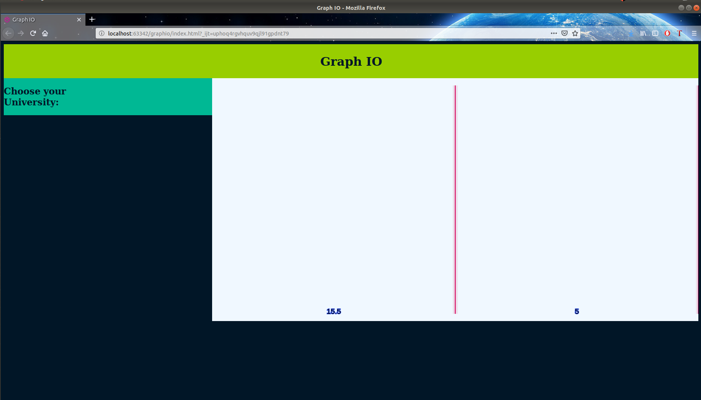

# Graph-IO
Projecto de página web en donde se muestran diferentes formas de trabajar con los grafos, tales como: 
- Mapeo de una ciudad para luego buscar el camino más corto
- Simular una red social
- etc.

## ACTUALMENTE
A futuro, esto se convertirá en un página web. Por el momento, se encuentra disponible un grafo trabajado
en conjunto con un canvas(`<canvas>`) para representar los cursos que se llevan en una carrera y cómo una
depende de la otra para llevarla. De esta manera, puedes planear qué cursos llevar en un ciclo y cómo afectará
a los restantes (alargar tu estancia en la universidad unos ciclos extras o reducirlos). 
__OBS: Este grafo aún no posee nombre.__

## COLABORACION
Si deseas colaborar con alguno de estos grafos, o con la página en sí (sobre todo frontend), es bienvenido.
En la rama `collaborations` se aceptan pull requests.

## IMAGENES DEL PROYECTO

